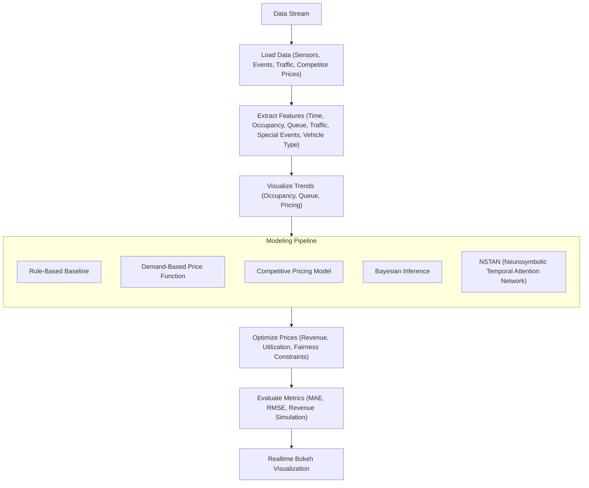

# Capstone Project - Summer Analytics 2025

## Dynamic Parking Pricing System

This capstone project during Summer Analytics hosted by IITG addresses the challenge of optimizing urban parking utilization through a **dynamic pricing engine**. Implemented entirely in Google Colab, my solution leverages real-time data and a staged modeling pipeline to ensure prices reflect actual demand, environmental factors, and competition.

## The Approach

### 1. Data Handling & Exploration

- **Data Loading:** Used pandas to ingest the provided dataset, which included occupancy, queue length, traffic, special events, and vehicle type for 14 parking spaces.
- **Preprocessing:** 
  - Converted date and time columns into datetime objects.
  - Handled missing values and ensured all features were in usable formats.
  - Engineered time-based features (hour, day, weekday/weekend) and encoded categorical variables.

### 2. Modeling Pipeline

#### A. Rule-Based Baseline

- **Logic:** Established a simple rule: if occupancy or queue length exceeded a threshold, the price increased; otherwise, it remained constant or decreased.
- **Purpose:** Served as a transparent, interpretable baseline to compare more advanced models.

#### B. Classical Machine Learning

- **Regression Models:** Implemented linear regression and decision trees to capture relationships between occupancy, queue, traffic, and price.
- **Feature Selection:** Used occupancy rate, queue length, traffic condition, special day, and vehicle type as primary predictors.
- **Cross-Validation:** Employed time series split to ensure robust model evaluation.

#### C. Demand-Based Pricing Function

- **Mathematical Model:** Constructed a demand function combining occupancy, queue, traffic, special events, and vehicle type.
- **Price Adjustment:** Adjusted prices smoothly based on normalized demand, ensuring prices remained within reasonable bounds.
- **Smoothing:** Applied rolling averages and constraints to prevent erratic price jumps.

#### D. Bayesian Inference

- **Uncertainty Quantification:** Used PyMC to build probabilistic models, allowing the system to estimate confidence intervals for price recommendations.
- **Outcome:** Provided more robust pricing, especially under uncertain or rare conditions.

#### E. Neurosymbolic Temporal Attention Network (NSTAN)

- **Custom Neural Model:** Developed a neural network with temporal attention layers to focus on recent and relevant historical data.
- **Symbolic Rule Integration:** Incorporated business rules as hard constraints within the neural architecture.
- **Uncertainty Output:** The model predicts not only the price but also an uncertainty bound, aiding decision-making during unusual demand spikes.

### 3. Real-Time Simulation

- **Pathway Integration:** Leveraged Pathway for real-time data streaming and feature processing.
- **Continuous Prediction:** The system ingests data, processes features, and emits price recommendations in real time.

### 4. Optimization

- **Objective:** Maximized utilization and revenue while ensuring customer fairness.
- **Method:** Used `scipy.optimize.minimize` to find optimal prices subject to business and regulatory constraints.

### 5. Visualization & Reporting

- **Exploratory Plots:** Used matplotlib, seaborn, and plotly for visualizing occupancy trends, queue distributions, and pricing evolution.
- **Real-Time Dashboards:** Integrated Bokeh for interactive, real-time pricing visualizations per parking space.

## Tech Stack

| Component         | Technology Used                        |
|-------------------|----------------------------------------|
| Programming       | Python 3.x                             |
| Data Analysis     | pandas, numpy, seaborn, matplotlib     |
| Deep Learning     | Custom neural attention (NSTAN)        |  
| Visualization     | bokeh, matplolib                       |
| Optimization      | scipy.optimize                         |
| Real-Time Engine  | Pathway                                |
| Platform          | Google Colab                           |

## Architecture Diagram

## Architecture Flow (Explanation)

1. **Data Ingestion:** Load and preprocess real-time parking data.
2. **Feature Engineering:** Extract time, environmental, and vehicle features.
3. **Exploratory Analysis:** Visualize patterns and trends.
4. **Modeling Layer:**
   - Rule-Based Engine
   - Classical ML Models
   - Bayesian Inference
   - NSTAN (Neurosymbolic Temporal Attention Network)
5. **Optimization Module:** Price recommendation under constraints.
6. **Evaluation & Reporting:** Metrics and interactive dashboards.
7. **Output:** Real-time, explainable price recommendations.

## Guide
**To run:**
1. Clone the repository.
2. Import the notebook in Google Colab.
3. Additionally upload the dataset in the same location in the drive as the notebook and name it 'dataset.csv'.
4. Run the notebook.
5. Explore the results and visualizations.

## Conclusion

This approach ensures that the pricing system is robust, interpretable, and responsive to real-world fluctuations, all while being fully reproducible in Google Colab. The staged modeling—from rules to neural-symbolic attention—enables both transparency and sophistication in pricing decisions.

## References 
- **Pathway User Guide:**  
  [https://pathway.com/developers/user-guide/deployment/from-jupyter-to-deploy/]

- **Pathway Real-Time App Tutorial:**  
  [https://pathway.com/developers/user-guide/introduction/first_realtime_app_with_pathway/]

- **Summer Analytics 2025 Course:**  
  [https://www.caciitg.com/sa/course25/]

